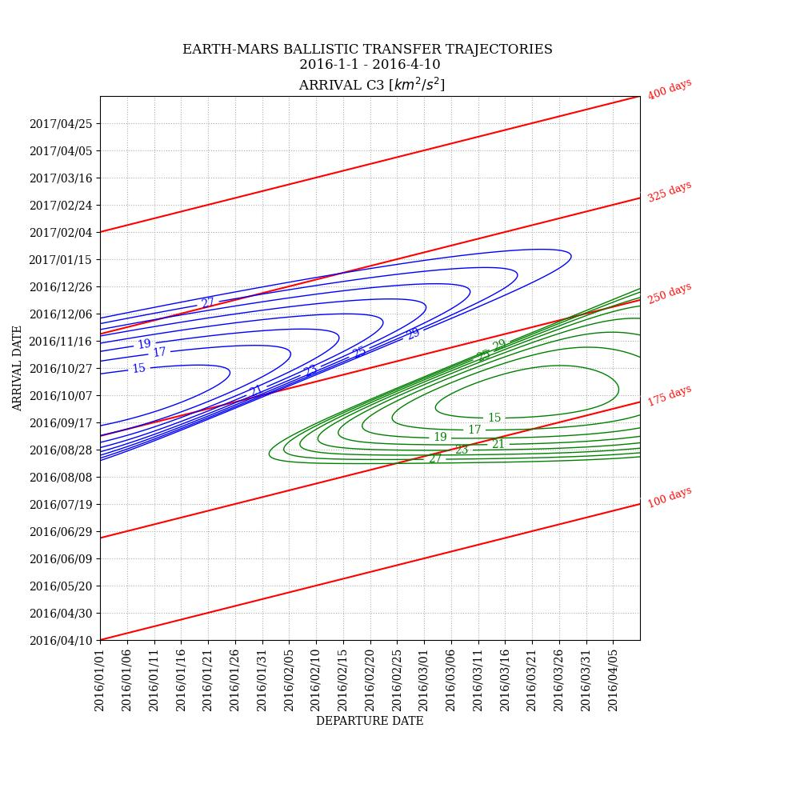

# porkchop 

Porkchop plotting tool for ballistic transfer trajectories.



## dependencies

- [esa/pykep](https://github.com/esa/pykep/)
    - note this has a boost dependency so install that however, e.g. `sudo apt-get install libboost-all-dev` 
    - on ubuntu 20.04 the current pykep branch has a bug with cmake and finding a boost dependency so there is a patch for that, applied with `git apply ../../fix-cmake-build-error-boost_find_component.patch`
- [nlohmann/json](https://github.com/nlohmann/json)
    - this is not a git submodule as its just a single header and the repo is pretty bloated
- matplotlib
- numpy

## usage

```bash
# make the meson build directory
meson builddir
./run.sh all
```

## future work

- use pybind and have python bindings for porkchop::generate so we dont have to do IO
- make it more robust

## references

* George, L.E. and Kos, L.D. (1998). Interplanetary Mission Design Handbook: Earth-to-Mars Mission Opportunities and Mars-to-Earth Return Opportunities 2009-2024. URL: https://ntrs.nasa.gov/citations/19980210557
* Goldman, E. (2003). Launch Window Optimization: The 2005 Mars REconnaissance Orbiter (MRO) Mission. URL: https://web.archive.org/web/20170413110956/http://ccar.colorado.edu/asen5050/projects/projects_2003/goldman/
* Burke, L.M, Falck, R.D, and McGuire, M.L. (2010). Interplanetary Mission Design Handbook: Earth-to-Mars Mission Opportunities 2026 to 2045. URL: https://ntrs.nasa.gov/citations/20100037210
* Woolley, R.C. and Wetsel, C.W. (2013). On The Nature of Earth-Mars Porkchop Plots
* D. Izzo, (2014) Revisiting Lambert's Problem. URL: https://arxiv.org/abs/1403.2705
